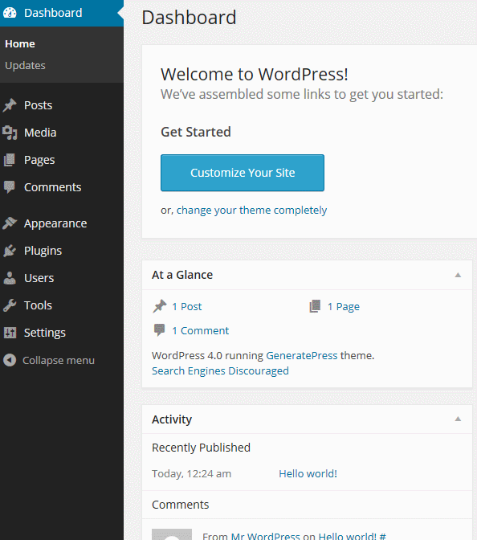
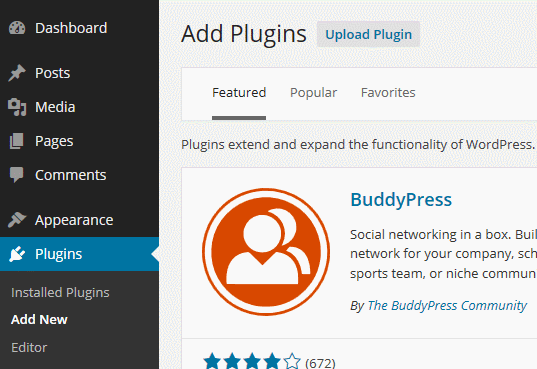
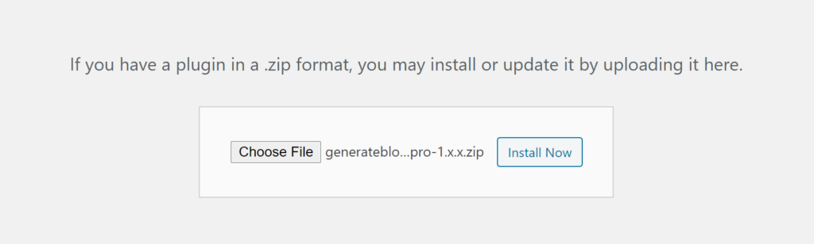

# Installazione

Puoi installare [Formello](https://formello.net) in due modi: tramite il pannello Plugin di WordPress o caricando il file zip manualmente.

From your Dashboard, go to **Plugins &gt; Add New**.

